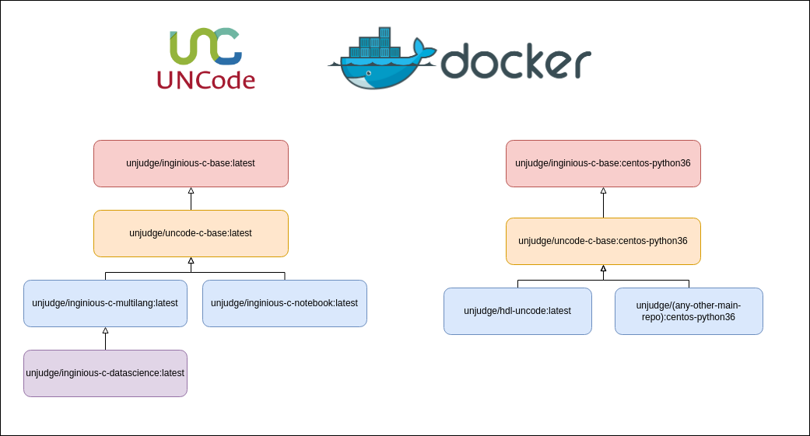

# UNCode containers

[][travis_url]
[][license_url]
[][contributors_url]
[][issues_url]
[][codacy_url]
[][cla_url]
[][gitter_url]

This repository contains all different grading containers for UNCode which are available on [Docker Hub][docker_hub_uncode].

Not all the containers are used for UNCode, some of them where created for [INGInious-containers][inginious_url], thus,
only the ones we have developed and use are explained here.

## Containers:

The image below shows the hierarchy of the different containers:



### [unjudge/inginious-c-base][unjudge/inginious-c-base_url]

The code related to this container is in the [main repository][base_container_github_url]. This container contains all
 the logic to run the submissions and send back the feedback to the student.

### [unjudge/uncode-c-base][unjudge/uncode-c-base_url]

This container is not directly in charge of evaluating a student's submission, it contains code that all the other
 containers use to evaluate the submission in the correct environment. The code is in `grading/uncode`. This container
 also contains the translations for different grading containers

### [unjudge/inginious-c-multilang][unjudge/inginious-c-multilang_url]

This container is in charge of evaluating C/C++, Java 7/8 and Python3 submissions as well as custom input executions.
 Here are accepted either single code submission or file project submissions. The code is in `grading/multilang`.

### [unjudge/inginious-c-datascience][unjudge/inginious-c-datascience_url]

As this container inherits from the multilang container, it does not add any different way to evaluate the submission,
 the difference of this container is that it allows submission that uses python modules commonly used in data science,
 such as Pandas, Numpy, among others. The `Dockerfile` is in `grading/data_science`.

### [unjudge/inginious-c-notebook][unjudge/inginious-c-notebook_url]

Container in charge of grading notebook submissions, for that, it receives a `.ipynb` file with the student's code. Thus,
 this is a different grading environment which can be selected in the task settings on UNCode. The code is located in
 `grading/notebook`. 


### [unjudge/hdl-uncode][unjudge/hdl-uncode_url]

Submissions with Verilog and VHDL code are graded inside this container. The code is in `grading/hdl`.

## Getting started

### Built with

Each mentioned grading environment is developed with [Python (with pip) 3.5+][python_url].

### Build containers

To build a container to test changes, run the next command:
```bash
docker build -t <container_tag> ./grading/<container_path>
```

### Run tests

Tests have been developed for the multilang container, in case you they have changed, you can run them as follows:
```bash
docker run -v <absolute_path_to_multilang>/grading/:/python_lib/grading \
    -v <absolute_path_to_multilang>/tests/:/python_lib/tests \
    ingi/inginious-c-multilang /bin/sh -c "mkdir -p /task/student; export PYTHONPATH=/python_lib:$PYTHONPATH; cd /python_lib && pip3 install pytest && pytest tests"
```
Where `<absolute_path_to_multilang>` is the absolute path the multilang container code, for instance: `/home/user/Desktop/INGInious-containers/grading/multilang`.
 It must be the absolute path, otherwise it will fail to start.
 
### Translate messages

It is possible to translate the messages returned from the containers. This adds support for internationalization (i18n). This is quite similar to the way it is done in the frontend.
This is done using the module `gettext` which installs the function `_()` in python to make it accessible in all the code, also, the messages are extracted and compiled using `pybabel`.
The i18n related files per language, are located in `grading/uncode/lang/`.

**Note**: Every time a Pull Request is done to master, an automatic check is done to verify that the i18n files are up to date.

#### 1. Mark a message as translatable

To mark a message as translatable, use the function `_("Message to translate")`, which encloses the string to translate.

#### 2. Extract marked messages

To extract the marked messages as translatable from the files, run the next command.

```bash
pybabel extract -o messages.pot .
```

#### 3. Update messages 

To update the messages files for each language, run the next command. After that, you can add translate the messages in the language you want to translate in `grading/uncode/lang/`.

```bash
pybabel update -i messages.pot -d grading/uncode/lang/
```

#### 4. Compile messages 

Finally, the messages need to be compiled to correctly load the translations, run the next command:

```bash
pybabel compile  -d grading/uncode/lang/
```

## Documentation

For additional documentation, please refer to the [Wiki][uncode_wiki_url].

## Roadmap

See the [UNCode GitHub Project][project_url] for a list of proposed features for UNCode, known issues and how they are
 being tackled.

## Contributing

Go to [CONTRIBUTING][contributing_url] to see the guidelines and how to start contributing to UNCode.

## License

Distributed under the AGPL-3.0 License. See [LICENSE][license_url] for more information.

## Contact

In case of technical questions, please use the [gitter communication channel][gitter_url].

In case you want to host your course on our deployment, email us on: <uncode_fibog@unal.edu.co>

UNCode: <https://uncode.unal.edu.co>

Project page: <https://juezun.github.io/>

[license_url]: https://github.com/JuezUN/INGInious-containers/blob/master/LICENSE
[travis_url]: https://travis-ci.org/JuezUN/INGInious-containers
[codacy_url]: https://www.codacy.com/gh/JuezUN/INGInious-containers/dashboard?utm_source=github.com&amp;utm_medium=referral&amp;utm_content=JuezUN/INGInious-containers&amp;utm_campaign=Badge_Grade
[uncode_url]: https://uncode.unal.edu.co/courselist
[contributors_url]: https://github.com/JuezUN/INGInious-containers/graphs/contributors
[issues_url]: https://github.com/JuezUN/INGInious-containers/issues
[cla_url]: https://cla-assistant.io/JuezUN/INGInious-containers
[gitter_url]:https://gitter.im/uncode-unal/community?utm_source=badge&utm_medium=badge&utm_campaign=pr-badge
[docker_hub_uncode]: https://hub.docker.com/r/unjudge
[inginious_url]: https://github.com/UCL-INGI/INGInious-containers
[python_url]: https://www.python.org/
[uncode_wiki_url]: https://github.com/JuezUN/INGInious/wiki
[project_url]: https://github.com/orgs/JuezUN/projects/3
[contributing_url]: https://github.com/JuezUN/INGInious-containers/blob/master/CONTRIBUTING.md
[base_container_github_url]: https://github.com/JuezUN/INGInious/tree/master/base-containers/base
[unjudge/inginious-c-base_url]: https://hub.docker.com/r/unjudge/inginious-c-base
[unjudge/uncode-c-base_url]: https://hub.docker.com/r/unjudge/uncode-c-base
[unjudge/inginious-c-multilang_url]: https://hub.docker.com/r/unjudge/inginious-c-multilang
[unjudge/inginious-c-datascience_url]: https://hub.docker.com/r/unjudge/inginious-c-datascience
[unjudge/inginious-c-notebook_url]: https://hub.docker.com/r/unjudge/inginious-c-notebook
[unjudge/hdl-uncode_url]: https://hub.docker.com/r/unjudge/hdl-uncode